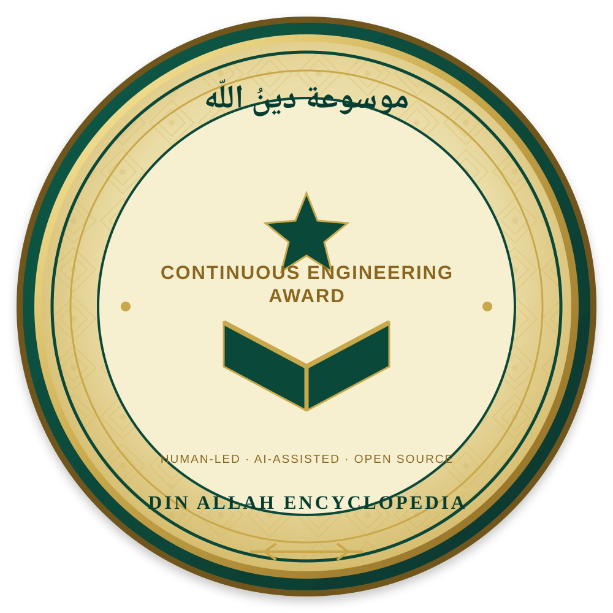

# 🏆 Din Allah Encyclopedia — Continuous Engineering Award

  

## 🥇 What this mark means

This mark recognizes the **continuous engineering effort** behind the Din Allah Encyclopedia: persistent debugging, verification, security hardening, acquisition engineering, provenance-aware source handling, and the pursuit of a genuinely open Islamic knowledge corpus.

It is a **project identity mark**, not a claim of endorsement by GitHub, OpenAI, or any external organization.

### 🤝 Collaboration principle

**Human-led · AI-assisted · Open Source**

The project remains human-directed and human-accountable. AI collaboration may assist with analysis, engineering diagnostics, workflow design, testing strategy, documentation, and problem solving; final project decisions remain with the repository owner and maintainers.

## Engineering values

- **Persistence over appearances:** a green workflow is not enough; artifacts and actual results matter.
- **Acquire first, store first:** successful PDF acquisition must survive later reporting or catalog failures.
- **Resilience:** one unresolved book or one malformed catalog record must not unnecessarily terminate an acquisition cycle.
- **Security:** governance and protected-branch controls remain part of the engineering system.
- **Provenance:** sources, rights, hashes, validation and review status remain distinguishable.
- **Open source:** prefer reproducible, free and inspectable tooling whenever practical.

> **A long-running project deserves a visible record of the work it took to keep it moving.**
